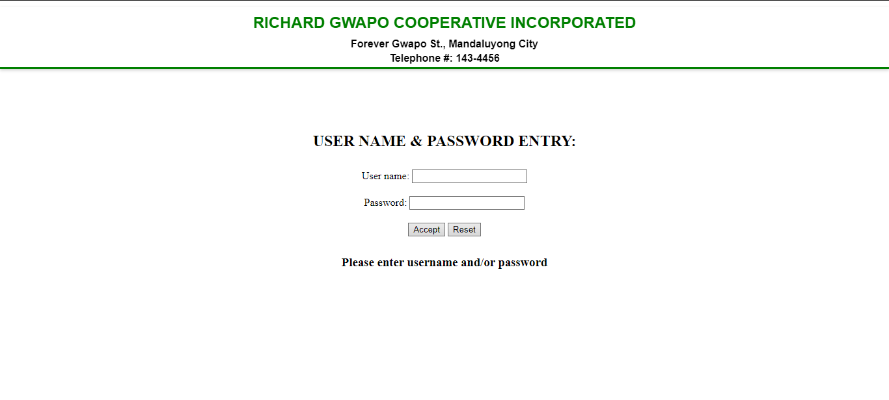
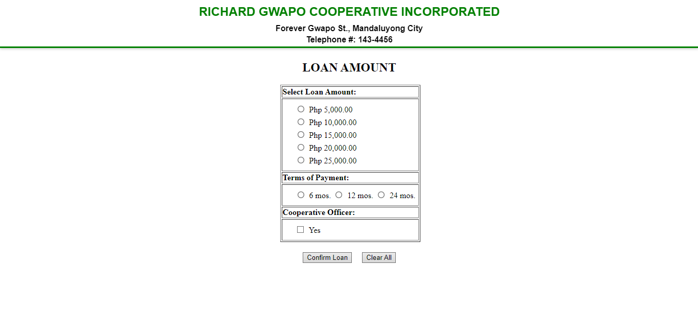
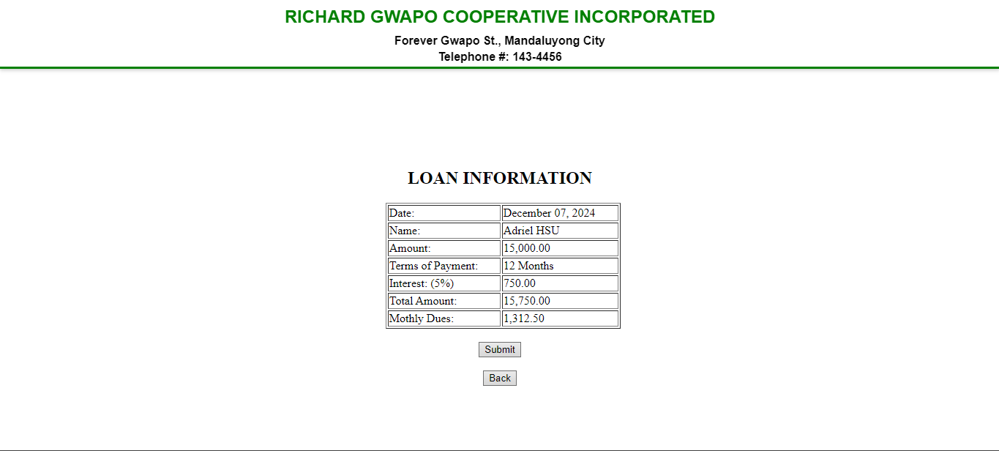
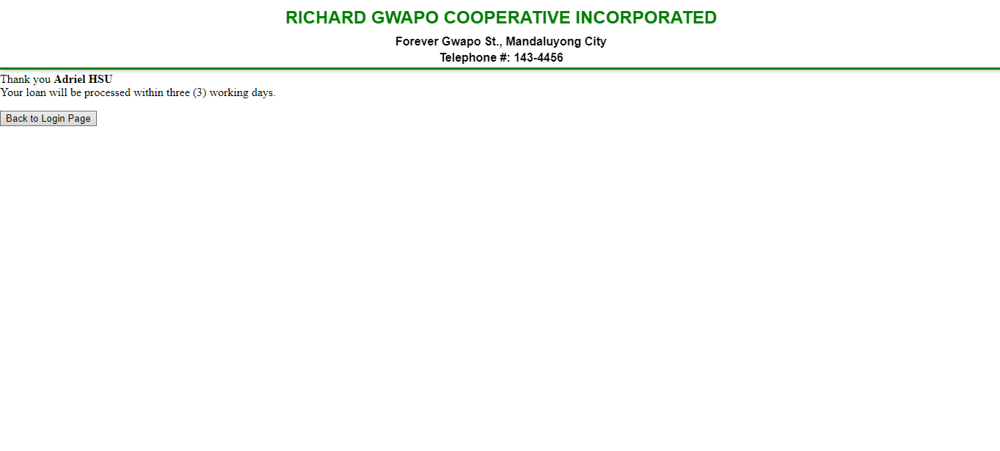

# PHP Loan System Project

This repository contains a PHP/MySQL project focused on creating a loan management system. It was completed during my Grade 12 year at the University of Makati as part of the **Laboratory Exercises for COMPROG 3** under the supervision of Mr. Roel Richard C. Traballo, a faculty member of the College of Computer Science. The system is a simulation of a basic loan application process, including user authentication, loan calculation, and loan confirmation functionalities.

---

## Table of Contents
1. [Project Overview](#project-overview)
2. [Features](#features)
3. [System Workflow](#system-workflow)
4. [Technologies Used](#technologies-used)
5. [Setup Instructions](#setup-instructions)
6. [Database Details](#database-details)
7. [File Structure](#file-structure)
8. [Screenshots](#screenshots)
9. [Acknowledgments](#acknowledgments)
10. [License](#license)

---

## Project Overview

The **PHP Loan System Project** is a dynamic web application that guides users through the loan application process. The system includes multiple pages to ensure that the user experience is intuitive and structured. This includes:
- A **Login Page** where users authenticate their credentials.
- A **Loan Amount Page** for users to input loan details.
- A **Loan Information Page** to display computed loan data and monthly dues.
- A **Loan Confirmation Page** for finalizing the application process.

The project incorporates logic to validate user inputs, calculate interest rates, and provide accurate loan summaries based on membership type and loan term. The loan terms and interest rates are predefined in the system, as per the given problem description.

---

## Features

The project includes the following key features:

1. **Login System**
   - Validates username and password (limited to 5 characters).
   - Displays appropriate error messages for invalid inputs.
   - Proceeds to the loan process upon successful authentication.

2. **Loan Amount Input**
   - Users specify the loan amount and repayment term (6, 12, or 24 months).
   - Interest rates differ based on user type (Officer: 5%, Member: 10%).

3. **Loan Information Display**
   - Computes total interest, total payable amount, and monthly dues.
   - Offers options to confirm or reset entries.

4. **Loan Confirmation**
   - Summarizes the loan details.
   - Provides a "Back to Login Page" button to restart the process.

5. **Interactive Buttons**
   - **Accept**: Processes user login and navigates to the next page.
   - **Clear All**: Resets user input fields.
   - **Submit**: Finalizes loan application details.
   - **Back**: Navigates to the previous step.

---

## System Workflow

### Page 1: Login Page
- **Input Fields**: Username and Password (maximum of 5 characters each).
- **Outputs**:
  - **Error Message for Empty Values**: Prompts users to fill in all fields.
  - **Error Message for Incorrect Credentials**: Displays "Incorrect Username or Password."
  - **Success**: Displays "Password Accepted" and navigates to the Loan Amount page.

### Page 2: Loan Amount Page
- **Input Fields**:
  - Loan Amount
  - Repayment Term (6, 12, or 24 months)
- **Buttons**:
  - **Confirm Loan**: Proceeds to the Loan Information page.
  - **Clear All**: Resets all inputs to default.

### Page 3: Loan Information Page
- **Outputs**:
  - Computed interest, total payable amount, and monthly dues.
  - Displays values based on the user type (Officer or Member) and loan term.
- **Buttons**:
  - **Submit**: Confirms loan details and navigates to the Loan Confirmation page.
  - **Back**: Returns to the Loan Amount page.

### Page 4: Loan Confirmation Page
- **Outputs**:
  - Final loan details including interest, total payable amount, and monthly dues.
- **Button**:
  - **Back to Login Page**: Restarts the application process.

---

## Technologies Used

- **Backend**: PHP
- **Database**: MySQL
- **Frontend**: HTML, CSS, Bootstrap
- **Tools**: XAMPP/WAMP (for local server setup)

---

## Setup Instructions

1. **Clone the repository**:
   ```bash
   git clone https://github.com/your-username/PHP-Loan-System.git
   ```

2. **Import the Database**:
   - Use the `.sql` file included in the repository.
   - Import it into your MySQL database via PHPMyAdmin or a terminal.

3. **Configure Database Connection**:
   - Locate the database configuration section in the PHP files.
   - Update credentials to match your local MySQL setup.

4. **Run the Project**:
   - Start a local server using XAMPP or WAMP.
   - Access the project in your browser at `http://localhost/PHP-Loan-System`.

---

## Database Details

The database schema includes a table for user accounts and a reference loan table for calculations. Below are sample values:

### Loan Table (Reference for Interest Calculations)
| User Type  | Loan Amount | Interest (%) | Total Amount | Monthly Dues (6 mos) | Monthly Dues (12 mos) | Monthly Dues (24 mos) |
|------------|-------------|--------------|--------------|----------------------|-----------------------|-----------------------|
| Officer    | 5,000.00    | 5%           | 5,250.00     | 875.00              | 437.50               | 218.75               |
| Member     | 10,000.00   | 10%          | 11,000.00    | 1,833.33            | 916.67               | 458.33               |

---

## File Structure

```
PHP-Loan-System/
├── Login<LastFirstname>.php
├── LoanAmount<LastFirstname>.php
├── LoanInformation<LastFirstname>.php
├── LoanConfirmation<LastFirstname>.php
├── database.sql
└── README.md
```

---

## Screenshots

### Login Page


### Loan Amount Page


### Loan Information Page


### Loan Confirmation Page


---

## Acknowledgments

This project was guided by **Mr. Roel Richard C. Traballo**, faculty member of the College of Computer Science at the University of Makati. It was completed as part of the laboratory exercises for COMPROG 3 during my Grade 12 year.

---

## License

This project is licensed under the [MIT License](LICENSE).

---

Thank you for exploring this project!
